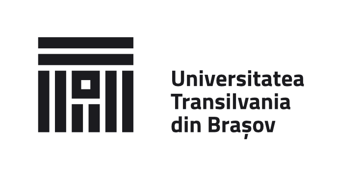
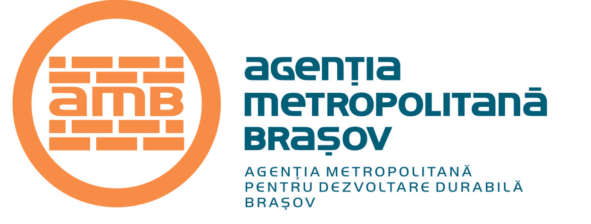

---

layout: col-sidebar
title: OWASP Brasov
tags: brasov
level: 4
region: Europe
meetup-group: OWASP-Brasov-Meetup
country: Romania
postal-code: 500429

---

### Welcome to OWASP Brasov Chapter ###

Welcome to the Brasov Chapter homepage. The chapter leaders are <a href="mailto:ilca.lucian@owasp.org">Ilca Lucian</a> and <a href="mailto:titus.balan@owasp.org">Titus Balan</a>. All events are often hosted by the OWASP (Open Web Application Security Project) Brasov Chapter.

For updates, events, membership; please visit our meet up page.
 
### OWASP AppSec Brasov [1] ###

[OWASP AppSec Brasov [1] - 11 A.M / 23 April 2021](https://www.meetup.com/owasp-brasov/events/277346025/)

<table cellpadding="15" cellspacing="0">
<tr>
<td>
<a href="#">TBA</a> 
</td>
<td>
<a href="#">TBA</a>
</td>
<td>
  <a href="#">TBA</a>
</td>
<td>
  <a href="#">TBA</a>
</td>
</tr>
</table>
 
### Participation ###
The Open Web Application Security Project (OWASP) is a nonprofit foundation that works to improve the security of software. All of our projects ,tools, documents, forums, and chapters are free and open to anyone interested in improving application security.

Chapters are led by local leaders in accordance with the [Chapter Leader Handbook](https://owasp.org/www-policy/rules-of-procedure/chapter-handbook). Financial contributions should only be made online using the authorized online donation button. To be a SPEAKER at ANY OWASP Chapter in the world simply review the [speaker agreement](https://owasp.org/www-policy/legal/speaker-agreement) and then contact the local chapter leaders with details of what OWASP Project, independent research, or related software security topic you would like to present.

Everyone is welcome and encouraged to participate in our [Projects](/projects), [Local Chapters](/chapters), [Events](/events), [Online Groups](https://groups.google.com/a/owasp.com/){:target='_blank'}, and [Community Slack Channel](https://owasp.slack.com/){:target='_blank'}. We especially encourage diversity in all our initiatives. OWASP is a fantastic place to learn about application security, to network, and even to build your reputation as an expert. We also encourage you to be [become a member](/membership) or consider a [donation](/donate) to support our ongoing work.

### News ###
- The usual location for meetings is <a href="https://www.google.com/maps/place/Faculty+of+Electrical+Engineering+and+Computer+Science/@45.6504219,25.589564,12z/data=!4m8!1m2!2m1!1sFaculty+of+Electrical+Engineering+and+Computer+Science!3m4!1s0x40b35b84d3da17b3:0x475bfde1216a2f6e!8m2!3d45.6554836!4d25.5992711">Transilvania University of Brasov.</a>
- Everyone is welcome to join us at our chapter meetings.

### Call For Speakers ###

Call For Speakers is open - if you would like to present a talk on Application Security at future OWASP Brasov Chapter events - please review and agree with the [OWASP Speaker Agreement](https://owasp.org/www-policy/legal/speaker-agreement) and send the proposed talk title, abstract and speaker bio to the Chapter Leaders via e-mail:

`ilca.lucian (at) owasp.org`

* Chapter Supporters *
----------------
The following are the list of OWASP Corporate Members who have generously aligned themselves with the Brasov chapter, therefore contributing funds to our chapter:

<table cellpadding="15" cellspacing="0">
<tr>
<td>

<!--  -->

</td>
<td>

</td>
<td>
  
</td>
</tr>
</table>
